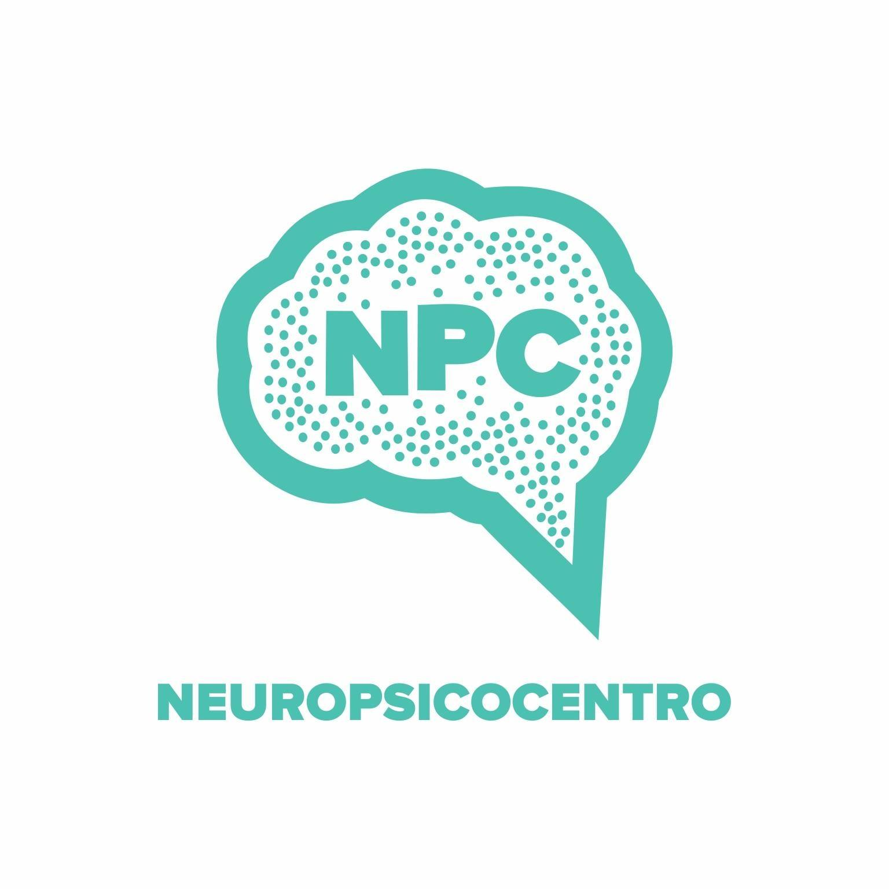

# Manual do Setor de T.I. – Neuropsicocentro

**Versão 1.0**  
**Atualizado em:** ________  
**Responsável:** Glaudiston Pereira  

---

## 1. Introdução

O setor de Tecnologia da Informação da Neuropsicocentro tem como missão garantir a continuidade dos serviços tecnológicos com segurança, eficiência e inovação, promovendo o bom funcionamento das unidades Neuropsicocentro, NPC Sul e NPC Life.

## 2. Estrutura Geral

🏢 **Unidades Atendidas:**

- Neuropsicocentro – Unidade principal
- NPC Sul – Unidade piloto (franquia)
- NPC Life – Unidade complementar com foco em atendimentos especializados

**Responsável Técnico:**  
**Glaudiston Pereira**  
Analista de T.I – Multicloud | Segurança | Suporte Linux e Windows  
📧 ti@neuropsiconcentro.com.br | 📱 WhatsApp: 85 98916-8479

**Samuel Albuquerque**  
Suporte Técnico em TI | AWS Cloud | Redes de Computadores | Windows & Linux | Help Desk  
📧 suporte@neuropsiconcentro.com.br | 📱 WhatsApp: 85 98784-0939

## 3. Serviços Prestados pelo Setor de T.I.

| Categoria | Serviço | Frequência |
|----------|---------|------------|
| **Suporte Técnico** | Atendimento remoto e presencial a colaboradores | Diariamente |
|  | Manutenção preventiva de computadores | Mensal |
|  | Instalação e configuração de impressoras | Sob demanda |
|  | Apoio em apresentações, lives e videoconferências | Sob demanda |
| **Infraestrutura** | Gerenciamento de rede (Wi-Fi, cabeamento, roteadores) | Permanente |
|  | Monitoramento de servidores locais e backups | Semanal |
| **Segurança da Informação** | Atualização de antivírus e patches | Quinzenal |
|  | Políticas de senha e controle de acesso | Permanente |
|  | LGPD e controle de dados sensíveis | Permanente |
| **Software / Sistemas** | Suporte e administração dos softwares institucionais | Diariamente |
| **Treinamentos** | Capacitação básica em uso de sistemas | Trimestral |
|  | Boletins informativos sobre boas práticas em T.I | Mensal |

## 💽 4. Softwares Utilizados

| Categoria | Nome do Software | Função Principal |
|----------|------------------|------------------|
| Gestão Clínica | Systea | Agendamentos, prontuários |
| Administrativo | Microsoft 365 / LibreOffice | Documentos, planilhas e comunicações |
| Backup | Google Drive | Segurança de dados |
| Antivírus | Kaspersky Free / Windows Defender | Proteção contra ameaças |
| Rede e Infra | PFSense / Mikrotik / Sophos / PRTG / Linux Bash / PowerShell | Firewall, VPN, DHCP, monitoramento |
| Suporte | AnyDesk / TeamViewer | Acesso remoto |

## 5. Procedimentos e Padrões

### **Abertura de Chamados:**

- Canal oficial: Zendesk
- Tempo de resposta: até 2h úteis
- Tempo de resolução: variável conforme criticidade

### **Classificação de Prioridades:**

| Nível | Exemplo | Prazo estimado |
|-------|---------|----------------|
| Alta | Rede caiu, sistema fora do ar | Até 2h |
| Média | Impressora parou, erro no software | Até 24h |
| Baixa | Atualização de programa, dúvidas | Até 48h |

## 6. Inventário de Equipamentos (Resumo)

**[Espaço reservado para preenchimento do inventário e logotipo da empresa]**

## 7. Política de Segurança e LGPD

- Senhas devem ser trocadas a cada 90 dias.
- Nenhum dado sensível pode ser salvo localmente fora da rede.
- Backups automáticos e criptografados.
- Acesso remoto apenas com autorização.
- Controle de logs de acesso.

## 8. Planejamentos Futuros

- Implementação de Azure AD para login unificado
- Migração de backups para Amazon S3
- Introdução de sistema de chamados próprio com indicadores SLA
- Dashboards de controle de chamados e SLA no Power BI

## 9. Procedimentos de Manutenção

- Limpeza física de computadores: mensalmente, com equipamento desligado.
- Verificação de integridade de cabos e conexões.
- Atualização de drivers e firmware dos equipamentos.

## 10. Controle de Acesso (futuro)

- Usuários são criados/desativados conforme entrada/saída de colaboradores.
- Níveis de permissão definidos com base na função.
- Acesso a pastas e sistemas críticos deve ser registrado e auditável.

## 11. Boas Práticas de Uso da Tecnologia

- Nunca compartilhe senhas, mesmo com colegas.
- Evite conectar dispositivos pessoais na rede corporativa.
- Em caso de erro ou lentidão, abra um chamado antes de tentar resolver sozinho.
- Sempre desligue o computador ao final do expediente, salvo quando orientado diferente.

## 12. Plano de Continuidade e Recuperação (futuro)

- Backups diários automáticos na nuvem e semanal em servidor local ou no Amazon S3
- Roteiro de recuperação em caso de perda de dados ou falha crítica.
- Checklist de procedimentos em caso de queda de energia ou internet.

## 13. Relatórios e Indicadores

- Relatório mensal de chamados abertos/fechados.
- SLA de atendimento por categoria.
- Gráficos no Power BI para acompanhamento do desempenho do setor.

## 14. Documentação Técnica Interna

- Diagramas de rede atualizados.
- Manual de instalação e configuração de impressoras.
- Lista com senhas mestras (armazenadas com criptografia).

## 15. Auditoria e Compliance

- Verificação semestral do cumprimento da LGPD.
- Logs de acesso revisados mensalmente.
- Checklist de conformidade com normas internas e externas.

---

### Inventário de Equipamentos (Detalhado)

**[Preencher manualmente conforme levantamento dos equipamentos em cada unidade]**

Itens sugeridos:

- Computadores (desktop/notebook): modelo, série, unidade, status
- Impressoras: modelo, tipo de conexão, localização
- Switches e roteadores: marca, modelo, configuração
- Servidores: especificações, sistema operacional, função
- Nobreaks e periféricos: status e manutenção
